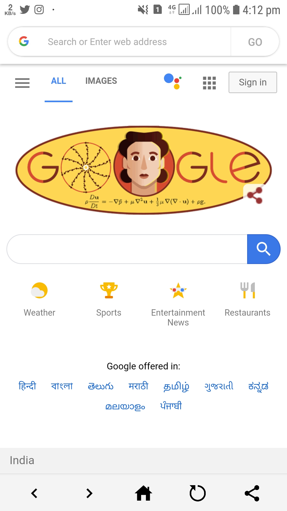
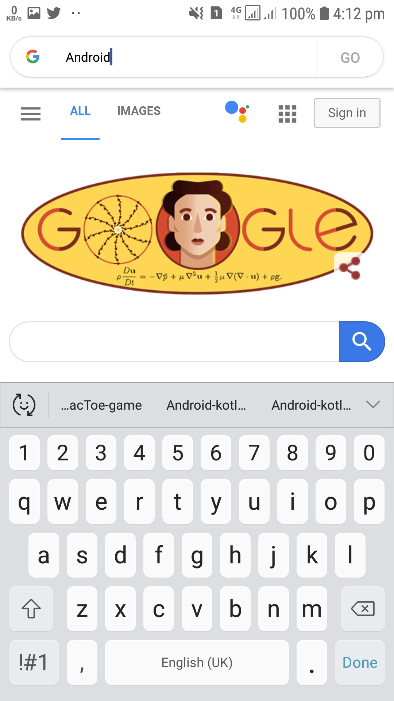
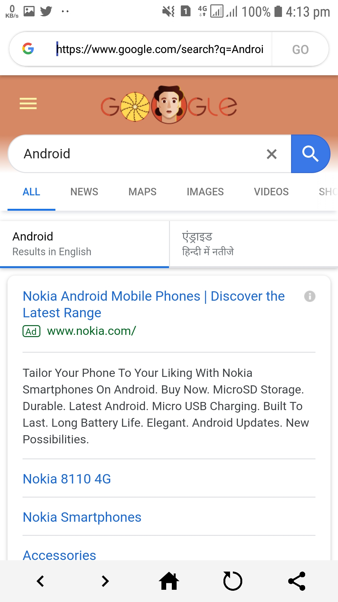
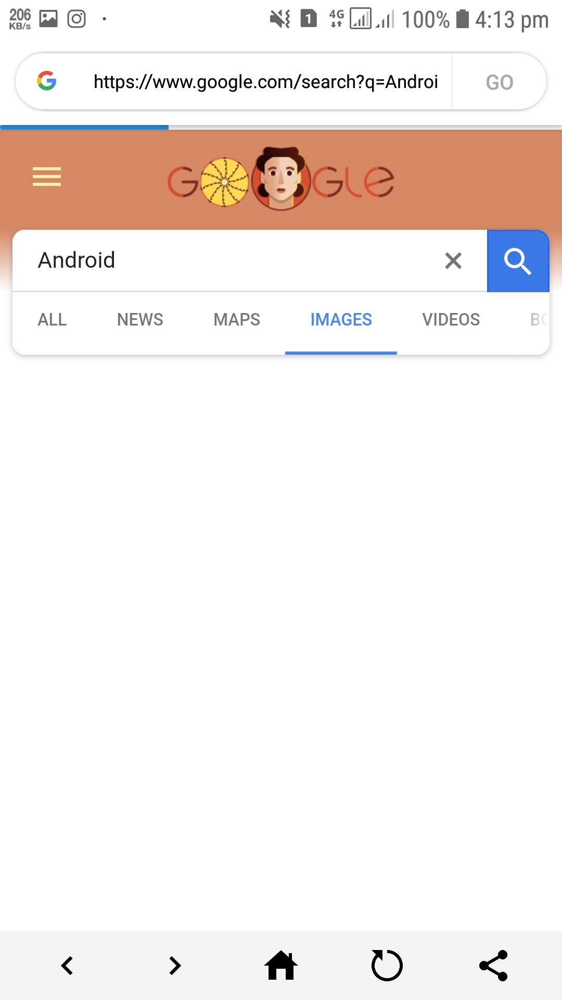
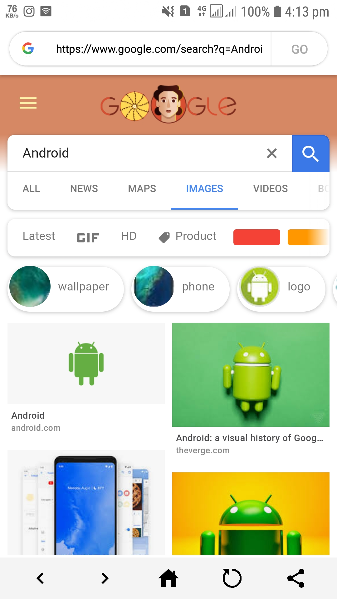
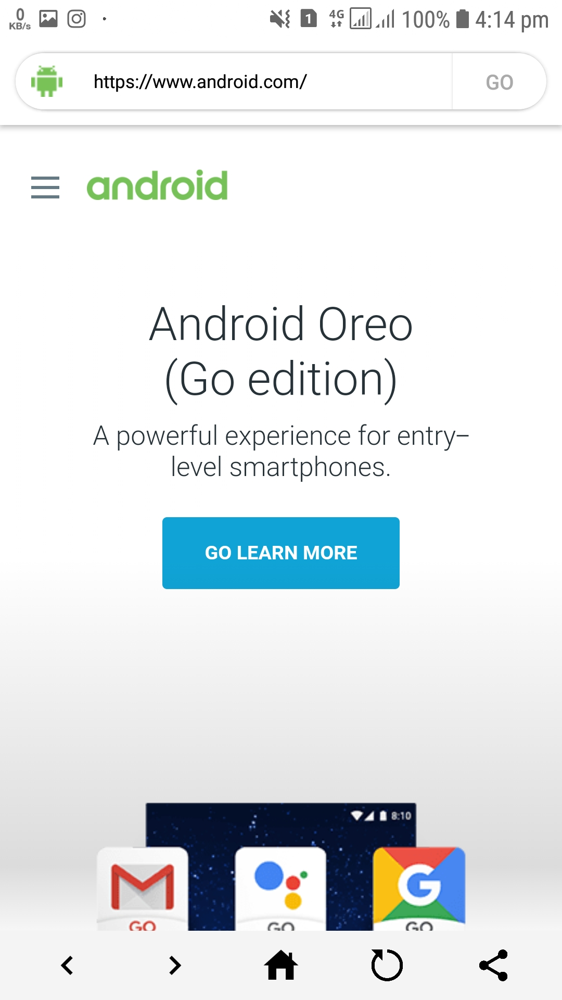

#  Excalibur Browser app

## Overview

Build an android web browser app for Internet Surfing, accessing Website Address or allowing Google Search

It is a Web Browser app with Internet permissions enabled to access web pages over internet servers onto a view in android known as` WebView`. This view accesses and extracts the web pages on the basis of user defined search text. For any particular item searched by the user, it ongoes `Google` Search, else it performs action to open a `Web Address` provided by the user. 

Its a Browsing App which uses webview to show web pages!!

## Features

* WebView
* Javascript Functions Enabled
* Customised buttons
* CardView
* ImageView
* Minimal Design
* Simplified Theme
* Responsive BackPress
* Well Constrained Layout

## Platform
        -> Android Studio
        -> With Kotlin Support

## Instructions

1. Clone or download the repo: `https://github.com/ashish7zeph/android-kotlin-Excalibur-browser`
2. Navigate to the folder `android-kotlin-Excalibur-browser`
3. Navigate to the folder `android-kotlin-Excalibur-browser/app/src/` to access developers content
3. Navigate to the folder `apk` for users to access apk
4. Copy the apk from folder `apk` to an android phone
5. Install the apk

The app is finally installed on your Android mobile device !!

To directly download the apk visit the [link](https://github.com/ashish7zeph/android-kotlin-Excalibur-browser/tree/master/apk)

 # Screenshots:

 
 

 
 

## Kotlin Android Activity

For Kotlin code files visit the [link](https://github.com/ashish7zeph/android-kotlin-Excalibur-browser/tree/master/app/src/main/java/com/zeph7/recipefinder)

Backend files are stored in a single package:

* [activity](https://github.com/ashish7zeph/android-kotlin-Excalibur-browser/tree/master/app/src/main/java/com/zeph7/excalibur)

Frontend resource files are stored in `res` package

* [res](https://github.com/ashish7zeph/android-kotlin-Excalibur-browser/tree/master/app/src/main/res)

Android manifest file for the project:

* [AndroidManifest.xml](https://github.com/ashish7zeph/android-kotlin-Excalibur-browser/blob/master/app/src/main/AndroidManifest.xml)
